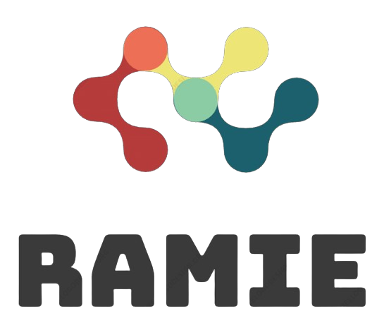
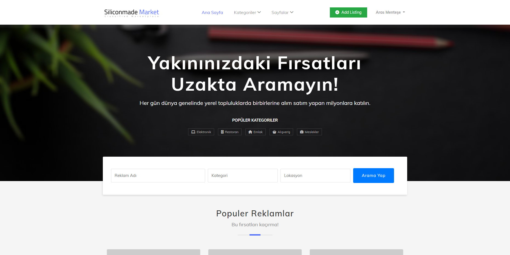
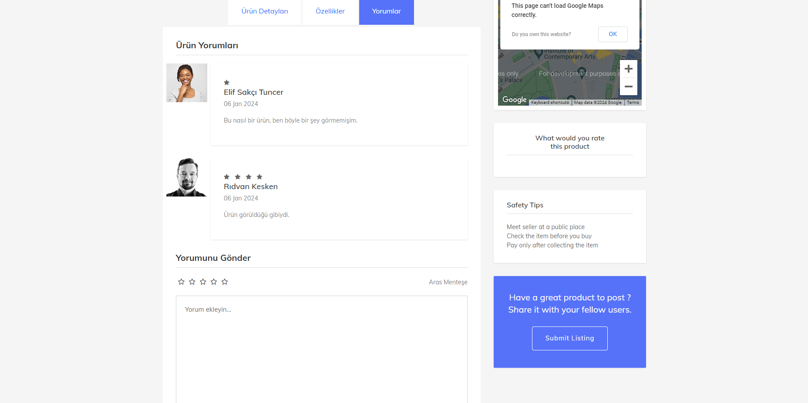
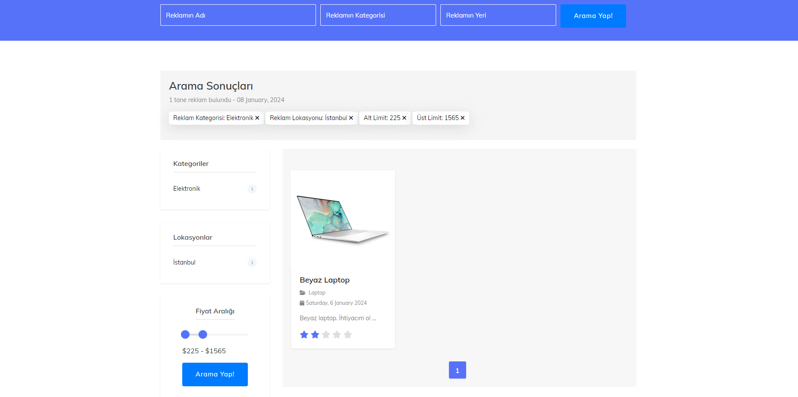
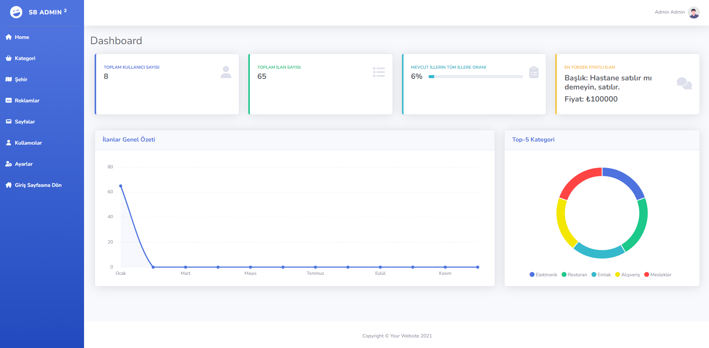

# AspNetMvcAds

<!-- Improved compatibility of back to top link: See: https://github.com/othneildrew/Best-README-Template/pull/73 -->

<!--
*** Thanks for checking out the Best-README-Template. If you have a suggestion
*** that would make this better, please fork the repo and create a pull request
*** or simply open an issue with the tag "enhancement".
*** Don't forget to give the project a star!
*** Thanks again! Now go create something AMAZING! :D
-->

<!-- PROJECT SHIELDS -->
<!--
*** I'm using markdown "reference style" links for readability.
*** Reference links are enclosed in brackets [ ] instead of parentheses ( ).
*** See the bottom of this document for the declaration of the reference variables
*** for contributors-url, forks-url, etc. This is an optional, concise syntax you may use.
*** https://www.markdownguide.org/basic-syntax/#reference-style-links
-->
[![Contributors][contributors-shield]][contributors-url]
[![MIT License][license-shield]][license-url]
[![LinkedIn][linkedin-shield]][linkedin-url]

<!-- PROJECT LOGO -->
 

  

  <h3 align="center">Advert MVC Project</h3>

  

    A protfolio project that uses .Net Core 7.0.14 MVC template.
     
    <a href="https://github.com/othneildrew/Best-README-Template"><strong>Explore the docs »</strong></a>
     
     
    <a href="https://github.com/othneildrew/Best-README-Template">View Demo</a>
    ·
    <a href="https://github.com/Wtell64/aspnet-mvc-ads/issues">Report Bug</a>
    ·
    <a href="https://github.com/Wtell64/aspnet-mvc-ads/blob/master/README.md">Request Feature</a>
  

<!-- TABLE OF CONTENTS -->

  
Table of Contents

  <ol>
    <li>
      <a href="#about-the-project">About The Project</a>
      <ul>
        <li><a href="#built-with">Built With</a></li>
      </ul>
    </li>
    <li><a href="#contributing">Contributing</a></li>
    <li><a href="#license">License</a></li>
    <li><a href="#contact">Contact</a></li>
  </ol>

<!-- ABOUT THE PROJECT -->
## About The Project

We developed an online advert publishing project where users can search and create advert that they are looking for or want to publish. Our website consist of many features such as search functionality, and an easy-to-use advert creation tool. With our user-friendly platform, individuals can effortlessly navigate through various categories and subcategories to find the specific advertisements they need or showcase their own. Whether you're searching for a job, selling items, or promoting services, our online advert publishing project provides a convenient and efficient solution for all your advertising needs.

Some other main functionalities are:
* Admin panel where admins can moderate the website, track performance metrics, and perform CRUD operations of various data used for the site
* Role based user system with three different authorization levels
* SMTP functionality, which can send and receive mails to and from users.
* Global exception handling to track website activity locally.

(<a href="#readme-top">back to top</a>)

### Built With

This section lists some of the main frameworks and technologies we used for this project.

* [![Bootstrap][Bootstrap.com]][Bootstrap-url]
* [![JQuery][JQuery.com]][JQuery-url]
* [![dotnet][dotnet.com]][dotnet-url]

(<a href="#readme-top">back to top</a>)

<!-- CONTRIBUTING -->
## Contributing

If you have a suggestion that would make this better, please fork the repo and create a pull request. You can also simply open an issue with the tag "enhancement".
Don't forget to give the project a star! Thanks again!

1. Fork the Project
2. Create your Feature Branch (`git checkout -b feature/Breadcrumbsaspnet-mvc-ads`)
3. Commit your Changes (`git commit -m 'Add some Breadcrumbsaspnet-mvc-ads'`)
4. Push to the Branch (`git push origin feature/Breadcrumbsaspnet-mvc-ads`)
5. Open a Pull Request

(<a href="#readme-top">back to top</a>)

<!-- LICENSE -->
## License

Distributed under the MIT License. See `LICENSE.txt` for more information.

(<a href="#readme-top">back to top</a>)

<!-- CONTACT -->
## Contact

Aras Menteşe - https://www.linkedin.com/in/aras-mentese-24847b175/ - LinkedIn 

Elif Sakçı Tuncer - N/A - LinkedIn 

İsmail Yücer - https://www.linkedin.com/in/ismailycer/ - LinkedIn

Muratcan Agiç - https://www.linkedin.com/in/muratcan-agiç-974b04219/ - LinkedIn

Rıdvan Kesken - https://www.linkedin.com/in/rıdvan-kesken-4a208b155/ - LinkedIn

(<a href="#readme-top">back to top</a>)

<!-- MARKDOWN LINKS & IMAGES -->
<!-- https://www.markdownguide.org/basic-syntax/#reference-style-links -->
[contributors-shield]: https://img.shields.io/badge/CONTRIBUTORS-5-blue?style=for-the-badge
[contributors-url]: https://github.com/Wtell64/aspnet-mvc-ads/graphs/contributors
[forks-shield]: https://img.shields.io/github/forks/othneildrew/Best-README-Template.svg?style=for-the-badge
[forks-url]: https://github.com/othneildrew/Best-README-Template/network/members
[stars-shield]: https://img.shields.io/github/stars/othneildrew/Best-README-Template.svg?style=for-the-badge
[stars-url]: https://github.com/othneildrew/Best-README-Template/stargazers
[issues-shield]: https://img.shields.io/github/issues/othneildrew/Best-README-Template.svg?style=for-the-badge
[issues-url]: https://github.com/othneildrew/Best-README-Template/issues
[license-shield]: https://img.shields.io/github/license/othneildrew/Best-README-Template.svg?style=for-the-badge
[license-url]: https://github.com/Wtell64/aspnet-mvc-ads/blob/master/LICENSE
[linkedin-shield]: https://img.shields.io/badge/-LinkedIn-black.svg?style=for-the-badge&logo=linkedin&colorB=555
[linkedin-url]: https://www.linkedin.com/in/aras-mentese-24847b175/
[product-screenshot]: images/screenshot.png

[React.js]: https://img.shields.io/badge/React-20232A?style=for-the-badge&logo=react&logoColor=61DAFB
[React-url]: https://reactjs.org/
[Vue.js]: https://img.shields.io/badge/Vue.js-35495E?style=for-the-badge&logo=vuedotjs&logoColor=4FC08D
[Vue-url]: https://vuejs.org/
[Angular.io]: https://img.shields.io/badge/Angular-DD0031?style=for-the-badge&logo=angular&logoColor=white
[Angular-url]: https://angular.io/
[Svelte.dev]: https://img.shields.io/badge/Svelte-4A4A55?style=for-the-badge&logo=svelte&logoColor=FF3E00
[Svelte-url]: https://svelte.dev/
[Laravel.com]: https://img.shields.io/badge/Laravel-FF2D20?style=for-the-badge&logo=laravel&logoColor=white
[Laravel-url]: https://laravel.com
[Bootstrap.com]: https://img.shields.io/badge/Bootstrap-563D7C?style=for-the-badge&logo=bootstrap&logoColor=white
[Bootstrap-url]: https://getbootstrap.com
[JQuery.com]: https://img.shields.io/badge/jQuery-0769AD?style=for-the-badge&logo=jquery&logoColor=white
[JQuery-url]: https://jquery.com 
[dotnet.com]: https://img.shields.io/badge/.Net-purple?style=for-the-badge&logo=dotnet
[dotnet-url]: https://dotnet.microsoft.com/en-us/

